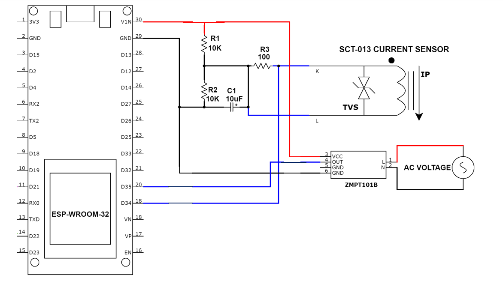

# Sistema de monitoramento de consumo de energia com ESP32 e Sensores:
Projeto de sistemas ubíquos para monitoramento de consumo de energia dentro de um prédio público.

## Descrição:

Esse código utiliza o sensor de tensão e corrente para monitorar o consumo de energia.

## Especificações e características:

Para o esp 32 foram utilizadas as seguintes bibliotecas:
```

  #include <WiFi.h>
  #include <PubSubClient.h>
  #include <ArduinoJson.h>
  #include "EmonLib.h"
  #include <stdio.h>
```
 O código da aplicação fica como:

 ```
#include <WiFi.h>
#include <PubSubClient.h>
#include <ArduinoJson.h>
#include "EmonLib.h"
#include <stdio.h>

EnergyMonitor SCT013;
EnergyMonitor ZMPT101B; // Cria uma instância de monitor de energia

int pinSCT = 34;   //Pino analógico conectado ao SCT-013
int pinZMPT = 35;   //Pino analógico conectado ao SCT-013

float potencia;
char str[20];

const char* ssid = "bravura";
const char* password = "12345678";
const char* mqtt_server = "test.mosquitto.org";
const int mqtt_port = 1883;
const char* mqtt_topic = "testeprojeto";

WiFiClient MonitorEnergy;
PubSubClient client(MonitorEnergy);

unsigned long previousMillis = 0;
const long interval = 1000; // Intervalo de 5 segundos

void setup_wifi() {
  delay(10);
  Serial.println();
  Serial.print("Conectando a ");
  Serial.println(ssid);

  WiFi.begin(ssid, password);

  while (WiFi.status() != WL_CONNECTED) {
    delay(500);
    Serial.print(".");
  }

  Serial.println("");
  Serial.println("WiFi conectado");
  Serial.println("Endereço IP: ");
  Serial.println(WiFi.localIP());
}

void callback(char* topic, byte* payload, unsigned int length) {
  //Serial.print("Mensagem recebida [");
  //Serial.print(topic);
  //Serial.print("] ");
  if ((char)payload[0] == '1') {
    digitalWrite(14, LOW);
  } else if ((char)payload[0] == '0') {
    digitalWrite(14, HIGH);
   } else {
    // Não faz nada
  }
}

void reconnect() {
  while (!client.connected()) {
    Serial.print("Tentando se reconectar ao MQTT Broker...");
    
    if (client.connect("MonitorEnergy")) {
      Serial.println("Conectado");
      client.subscribe(mqtt_topic);
      client.setKeepAlive(15);
    } else {
      Serial.print("Falha, rc=");
      Serial.print(client.state());
      Serial.println(" Tentando novamente em 5 segundos");
      delay(5000);
    }
  }
}


void setup() {
  Serial.begin(115200);
  SCT013.current(pinSCT, 1.75);
  ZMPT101B.voltage(35, 540, 1.7); // Configura a entrada do sensor de tensão no pino 35 (modifique conforme necessário), 234.26 é a calibração e 1.7 é o fator de fase
  setup_wifi();
  client.setServer(mqtt_server, mqtt_port);
  client.setCallback(callback);
}


void loop() {
  unsigned long currentMillis = millis();
  if (!client.connect("MonitorEnergy")) {
    reconnect();
    Serial.println("Tentei reconectar");
  }
  client.loop();
  //Serial.println("Passei");
  //Serial.println(currentMillis - previousMillis);
  double Irms = SCT013.calcIrms(1480) - 0.06;   // Calcula o valor da Corrente
  double Vrms = ZMPT101B.Vrms; // Obtém a tensão RMS
  ZMPT101B.calcVI(17,2000); // Calcula a tensão e corrente (20 ciclos de medição, intervalo de tempo de 2000ms)


  if (currentMillis - previousMillis >= interval) {
    StaticJsonDocument<200> doc;
    doc["corrente"] = Irms;
    doc["tensao"] = Vrms;
    String json;
    serializeJson(doc, json);
    
    previousMillis = currentMillis;
    if (!client.connected()) {
      reconnect();
      client.publish(mqtt_topic, json.c_str());
      Serial.println("Publiquei");
    }else{
      client.publish(mqtt_topic, json.c_str());
      Serial.println("Publiquei");
      }
    client.loop();

    Serial.print("Tensão RMS: ");
    Serial.print(Vrms);
    Serial.println(" V");    
    
    potencia = Irms * Vrms;          // Calcula o valor da Potencia Instantanea    
    Serial.print("Corrente = ");
    Serial.print(Irms);
    Serial.println("A");
    
    Serial.print("Potencia = ");
    Serial.print(potencia);
    Serial.println(" W");
   
    delay(500);
    Serial.print(".");
    delay(500);
    Serial.print(".");
    delay(500);
    Serial.println(".");
    delay(500);

  }
}
```

### Pinagem:

| Pino          | Saída      | Pino no ESP32          |
| ------------- | ---------- | ---------------------- |
| ${{\color{Red}\Huge{\textsf{  VCC \}}}}\$      | 1          | 5V |
| ${{\color{Gray}\Huge{\textsf{  GND \}}}}\$      | 2         | GND   |
| ${{\color{Lime}\Huge{\textsf{  OUT ZMPT101B \}}}}\$       | 3         | 34     |
| ${{\color{Blue}\Huge{\textsf{  OUT  SCT013\}}}}\$        | 4         | 35      |


## Esquema:



## Instruções de execuções:

Para executar o projeto localmente, siga estas etapas:

1. **Pré-requisitos**:
   - Instale a última versão da Arduino IDE a partir do [site oficial](https://www.arduino.cc/en/software).
   - Configure a Arduino IDE para suportar o ESP32 seguindo as instruções disponíveis na [documentação do ESP32](https://docs.espressif.com/projects/arduino-esp32/en/latest/installing.html).

2. **Execução da Aplicação**:
   - **Carregar o Código no ESP32**:
     1. Conecte o ESP32 ao seu computador.
     2. Abra o Arduino IDE.
     3. Carregue o código no ESP32.
     4. Quando o código rodar, dentro do Serial aparecerá o código em funcionamento como no exemplo [presença](./consumo.png)
