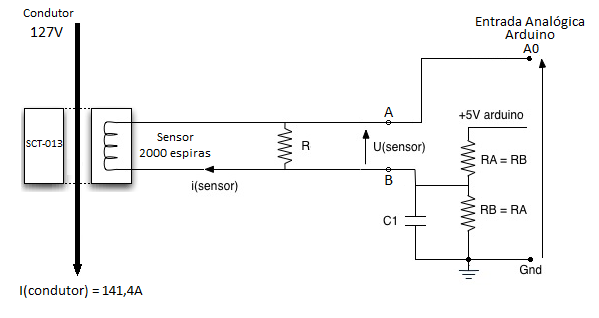

# Como usar com ESP32 – Sensor de corrente

## Descrição:

O sensor SCT013 é um sensor não invasivo utilizado para ler corrente que passa por um fio.


## Especificações e características:

 - 
## Datasheet:

[Datasheet SCT-013](https://github.com/welintonbg/EnergyMonitoring/blob/main/Sensores/SCT-013/datasheetSCT013.pdf)

## Aplicações:

Projetos com ESP32 ou outras plataformas microcontroladas em que seja necessário fazer a medição da corrente que alimenta determinada carga

### Circuito:




Onde: 
R = 330
RA = RB = 10K

### Comunicação com o ESP32


### Bibliotecas:

```bash 
#include "EmonLib.h"
#include <stdio.h>

EnergyMonitor SCT013;

int pinSCT = 39;   //Pino analógico conectado ao SCT-013

float potencia;
char str[20];

void setup()
{

  Serial.begin(115200);
  SCT013.current(pinSCT, 7.0606);
}

void loop()
{
    double Irms = SCT013.calcIrms(1480);   // Calcula o valor da Corrente
   
    Serial.print("Corrente = ");
    Serial.print(Irms);
    Serial.println("A");

    Serial.print(".");
    delay(500);
    Serial.println(".");
    delay(500);

}
```


