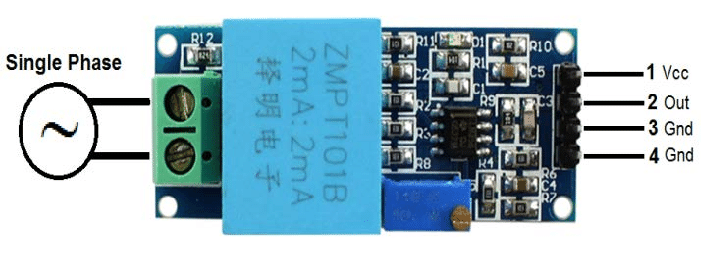

# Como usar com ESP32 – Sensor de tensão

## Descrição:

O sensor ZMPT101b é um sensor invasivo utilizado para ler a tensão.




## Especificações e características:

 - 
## Datasheet:

[Datasheet ZMPT101B](./datasheetZMPT101B.pdf)

## Aplicações:

Projetos com ESP32 ou outras plataformas microcontroladas em que seja necessário fazer a medição da corrente que alimenta determinada carga

### Pinagem:

| Pino          | Saída      | Pino no ESP32          |
| ------------- | ---------- | ---------------------- |
| ${{\color{Red}\Huge{\textsf{  - \}}}}\$      | 1          |- |
| ${{\color{Gray}\Huge{\textsf{  - \}}}}\$      | 2         |-   |
| ${{\color{Lime}\Huge{\textsf{  - \}}}}\$       | 3         | -      |
| ${{\color{Blue}\Huge{\textsf{  - \}}}}\$        | 4         | -       |


## Exemplo:

```bash 
#include "EmonLib.h"
#include <stdio.h>

EnergyMonitor ZMPT101B; // Cria uma instância de monitor de energia

int pinZMPT = 35;   //Pino analógico conectado ao ZMPT

char str[20];

void setup()
{

  Serial.begin(115200);
  ZMPT101B.voltage(35, 540, 1.7); // Configura a entrada do sensor de tensão no pino 35 (modifique conforme necessário), 234.26 é a calibração e 1.7 é o fator de fase

}

void loop()
{
    double Vrms = ZMPT101B.Vrms; // Obtém a tensão RMS

    ZMPT101B.calcVI(17,2000); // Calcula a tensão e corrente (20 ciclos de medição, intervalo de tempo de 2000ms)


    Serial.print("Tensão RMS: ");
    Serial.print(Vrms);
    Serial.println(" V");    
    
}
```


