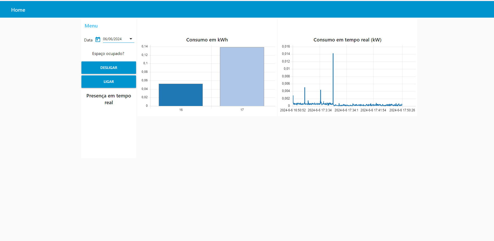

## NODE-RED

Para acessar o fluxo do Node-RED, você precisa acionar o CMD e rodar o comando "node-red".

Ao acessar o http://localhost:1880/ terá acesso aos fluxos do NODE-RED

Dentro dos fluxos do Node-RED. Os blocos amarelos são de funções inscritas em Javascript. Os blocos roxos são onde o MQTT foi configurado e os blocos verde é onde as operações do mongoDB foram implementadas. Por fim, os blocos em azul são os blocos que fazem a interface com o frontend onde há os botões e gráficos disponíveis na página http:/localhost:1880/ui

Para aprender a utilizar o Node RED foram utilizados os seguintes tutoriais:

Integração mongoDB e Node RED: https://www.youtube.com/watch?v=RoNucR0fdj0

Playlist sobre funções básicas do Node RED: https://www.youtube.com/watch?v=ksGeUD26Mw0&list=PLyNBB9VCLmo1hyO-4fIZ08gqFcXBkHy-6

Canal brasileiro que ensina como usar Node RED: https://www.youtube.com/c/NewayAutoma%C3%A7%C3%B5es
