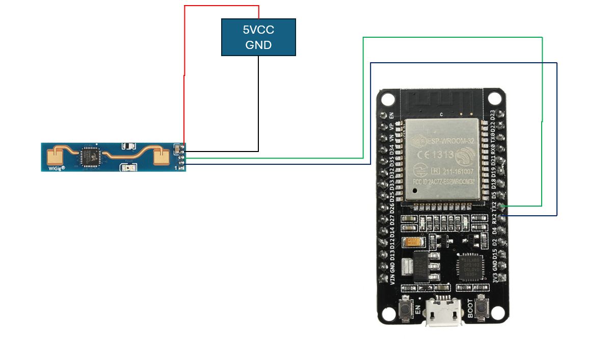

# Sistema de monitoramento de consumo de energia com ESP32 e Sensores:
Projeto de sistemas ubíquos para monitoramento de consumo de energia dentro de um prédio público.

## Descrição:

O projeto apresentado aqui tem como objetivo verificar o consumo de energia em determinado local e verificar a presença de pessoas no mesmo para identificar possíveis desperdícios. Para isso, foram utilizados os sensores de corrente, tensão e presença humana. Os dados foram transmitidos do ESP32 para a nuvem via MQTT e dentro do fluxo do Node-RED, salvos no banco mongoDB e visualizados em tela via dashboard

## Especificações e características:

Para o esp 32 foram utilizadas as seguintes bibliotecas:
```
  #include <ld2410.h>
  #include <WiFi.h>
  #include <PubSubClient.h>
  #include <ArduinoJson.h>
  #include "EmonLib.h"
  #include <stdio.h>
```
 O código da aplicação fica como:

 ```
 #include <WiFi.h>
#include <PubSubClient.h>
#include <ArduinoJson.h>
#include <ld2410.h>

const char* ssid = "ssid";
const char* password = "senha";
const char* mqtt_server = "test.mosquitto.org";
const int mqtt_port = 1883;
const char* mqtt_topic = "testeprojeto2";
const char* mqtt_topic2 = "ligardesligarprojeto2";

WiFiClient MonitorEnergy;
PubSubClient client(MonitorEnergy);
ld2410 radar;

#define RADAR_SERIAL Serial1
#define RADAR_RX_PIN 16
#define RADAR_TX_PIN 17
   

uint32_t lastReading = 0;
bool radarConnected = false;
uint32_t presenca;

unsigned long previousMillis = 0;
const long interval = 1000; // Intervalo de 5 segundos

void setup_wifi() {
  delay(10);
  Serial.println();
  Serial.print("Conectando a ");
  Serial.println(ssid);

  WiFi.begin(ssid, password);

  while (WiFi.status() != WL_CONNECTED) {
    delay(500);
    Serial.print(".");
  }

  Serial.println("");
  Serial.println("WiFi conectado");
  Serial.println("Endereço IP: ");
  Serial.println(WiFi.localIP());
}

void callback(char* topic, byte* payload, unsigned int length) {
  Serial.print("Mensagem recebida [");
  Serial.print(topic);
  Serial.print("] ");
  if ((char)payload[0] == '1') {
    digitalWrite(14, LOW);
  } else if ((char)payload[0] == '0') {
    digitalWrite(14, HIGH);
   } else {
    // Não faz nada
  }
}

void reconnect() {
  while (!client.connected()) {
    Serial.print("Tentando se reconectar ao MQTT Broker...");
    
    if (client.connect("MonitorEnergy")) {
      Serial.println("Conectado");
      client.subscribe(mqtt_topic2);
      client.setKeepAlive(15);
    } else {
      Serial.print("Falha, rc=");
      Serial.print(client.state());
      Serial.println(" Tentando novamente em 5 segundos");
      delay(5000);
    }
  }
}

uint32_t le_presenca()
{
  radar.read();
  if (radar.isConnected()) //Report every 1000ms
  {
    if (radar.presenceDetected())
    {  presenca = 1;
    
      if (radar.stationaryTargetDetected())
      {
        Serial.print(F("Stationary target: "));
        Serial.print(radar.stationaryTargetDistance());
        Serial.print(F("cm energy:"));
        Serial.print(radar.stationaryTargetEnergy());
        Serial.print(' ');
      }
      if (radar.movingTargetDetected())
      {
        Serial.print(F("Moving target: "));
        Serial.print(radar.movingTargetDistance());
        Serial.print(F("cm energy:"));
        Serial.print(radar.movingTargetEnergy());
      }
      Serial.println();
    }
    else
  {
    presenca = 0;
    Serial.println(F("No target"));
  }
  }
  
  return presenca;
}


void setup() {
  Serial.begin(115200); //Feedback over Serial Monitor
  RADAR_SERIAL.begin(256000, SERIAL_8N1, RADAR_RX_PIN, RADAR_TX_PIN); //UART for monitoring the radar
  setup_wifi();
  client.setServer(mqtt_server, mqtt_port);
  client.setCallback(callback);
  pinMode(14, OUTPUT);
  digitalWrite(14, HIGH);
  delay(500);
  Serial.print(F("\nConnect LD2410 radar TX to GPIO:"));
  Serial.println(RADAR_RX_PIN);
  Serial.print(F("Connect LD2410 radar RX to GPIO:"));
  Serial.println(RADAR_TX_PIN);
  Serial.print(F("LD2410 radar sensor initialising: "));
  if(radar.begin(RADAR_SERIAL))
  {
    Serial.println(F("OK"));
    Serial.print(F("LD2410 firmware version: "));
    Serial.print(radar.firmware_major_version);
    Serial.print('.');
    Serial.print(radar.firmware_minor_version);
    Serial.print('.');
    Serial.println(radar.firmware_bugfix_version, HEX);
  }
  else
  {
    Serial.println(F("not connected"));
  }
  
}


void loop() {
  unsigned long currentMillis = millis();
  if (!client.connected()) {
    reconnect();
    Serial.println("Tentei reconectar");
  }
  client.loop();
  //Serial.println("Passei");
  //Serial.println(currentMillis - previousMillis);

  if (currentMillis - previousMillis >= interval) {
    StaticJsonDocument<200> doc;
    doc["sensor"] = "ESP32";
    doc["value"] = le_presenca();
    String json;
    serializeJson(doc, json);
    
    previousMillis = currentMillis;
    if (!client.connected()) {
      reconnect();
      client.publish(mqtt_topic, json.c_str());
      Serial.println("Publiquei");
    }else{
      client.publish(mqtt_topic, json.c_str());
      Serial.println("Publiquei");
      }
    client.loop();
  }
}
```

### Pinagem:

| Pino          | Saída      | Pino no ESP32          |
| ------------- | ---------- | ---------------------- |
| ${{\color{Red}\Huge{\textsf{  VCC \}}}}\$      | 1          | 5V |
| ${{\color{Gray}\Huge{\textsf{  GND \}}}}\$      | 2         | GND   |
| ${{\color{Lime}\Huge{\textsf{  UART Rx \}}}}\$       | 3         | 16      |
| ${{\color{Blue}\Huge{\textsf{  UART Tx \}}}}\$        | 4         | 17       |


## Esquema:



## Instruções de execuções:

Para executar o projeto localmente, siga estas etapas:

1. **Pré-requisitos**:
   - Instale a última versão da Arduino IDE a partir do [site oficial](https://www.arduino.cc/en/software).
   - Configure a Arduino IDE para suportar o ESP32 seguindo as instruções disponíveis na [documentação do ESP32](https://docs.espressif.com/projects/arduino-esp32/en/latest/installing.html).

2. **Execução da Aplicação**:
   - **Carregar o Código no ESP32**:
     1. Conecte o ESP32 ao seu computador.
     2. Abra o Arduino IDE.
     3. Carregue o código no ESP32.
     4. Quando o código rodar, dentro do Serial aparecerá o código em funcionamento como no exemplo [presença](./presenca.png)
