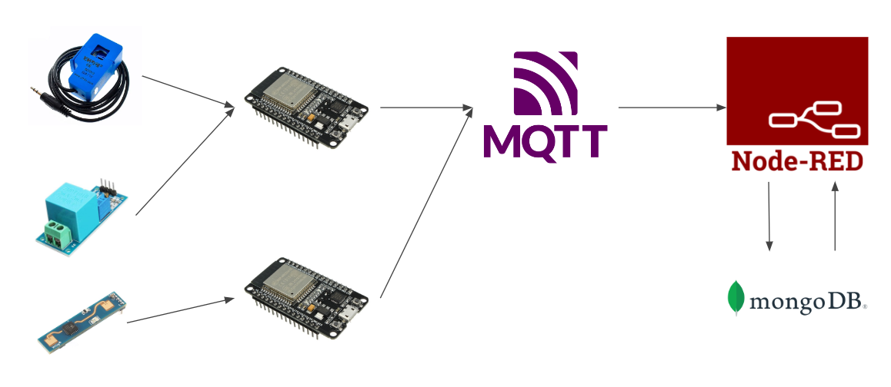

# Sistema de monitoramento de consumo de energia com ESP32 e Sensores:
Projeto de sistemas ubíquos para monitoramento de consumo de energia dentro de um prédio público.

## Descrição:

O projeto apresentado aqui tem como objetivo verificar o consumo de energia em determinado local e verificar a presença de pessoas no mesmo para identificar possíveis desperdícios. 




## Especificações e características:

 - Tensão de operação: 5VDC;

## Datasheet:

[Datasheet LD2410B](https://github.com/welintonbg/EnergyMonitoring/blob/main/Sensores/HLK-LD2410B/datasheetLD2410B.pdf)

## Aplicações:

Projetos com ESP32 ou outras plataformas microcontroladas em que seja necessário fazer a medição de presença humana em um deteminado local

### Pinagem:

| Pino          | Saída      | Pino no ESP32          |
| ------------- | ---------- | ---------------------- |
| ${{\color{Red}\Huge{\textsf{  VCC \}}}}\$      | 1          | 5V |
| ${{\color{Gray}\Huge{\textsf{  GND \}}}}\$      | 2         | GND   |
| ${{\color{Lime}\Huge{\textsf{  UART Rx \}}}}\$       | 3         | 16      |
| ${{\color{Blue}\Huge{\textsf{  UART Tx \}}}}\$        | 4         | 17       |


## Bibliotecas:

```bash 
  #include <ld2410.h>
```


