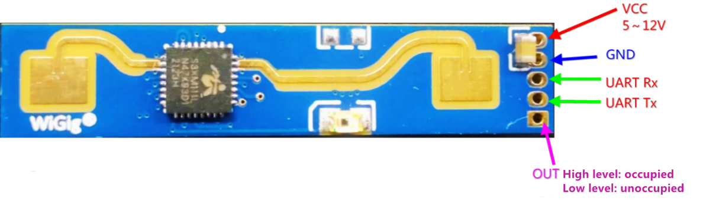

# Como usar com ESP32 – Sensor de Presença humana

## Descrição:

O sensor LD2410B é utilizado dentro de um ambiente onde se quer monitorar a presença humana em movimento e em repouso.




## Especificações e características:

 - Tensão de operação: 5VDC;

## Datasheet:

[Datasheet LD2410B](https://github.com/welintonbg/EnergyMonitoring/blob/main/Sensores/HLK-LD2410B/datasheetLD2410B.pdf)

## Aplicações:

Projetos com ESP32 ou outras plataformas microcontroladas em que seja necessário fazer a medição de pressão atmosférica, temperatura e altitude.

### Pinagem:

| Pino          | Saída      | Pino no ESP32          |
| ------------- | ---------- | ---------------------- |
| ${{\color{Red}\Huge{\textsf{  VCC \}}}}\$      | 1          | 5V |
| ${{\color{Gray}\Huge{\textsf{  GND \}}}}\$      | 2         | GND   |
| ${{\color{Lime}\Huge{\textsf{  UART Rx \}}}}\$       | 3         | 16      |
| ${{\color{Blue}\Huge{\textsf{  UART Tx \}}}}\$        | 4         | 17       |


## Bibliotecas:

```bash 
  #include <Adafruit_BMP280.h>
```

## Código:

OBS: Sobre o BMP280, é importante que seja verificado qual endereço o sensor está usando, visto que é possível alternar entre 0x76 e 0x77 alimentando o pino com a nomenclatura Data Out(SDO/SPI) a 5V ou ao GND, assim como é factível alternar entre a comunicação I2C e SPI, alimentando o pino Chip Select Bus a 5V ou ao GND. De acordo com as conexões acima, é necessário alterar algumas funções no código como bmp.begin(endereço do BMP280) e outras que são essenciais para a escolha do tipo de comunicação(I2C/SPI). Essas particularidades do BMP280 podem atrasar o desenvolvimento do projeto se não verificadas, pois dependendo das conexões dos pinos citados acima, o código recebe alterações relevantes que se não ajustadas prejudicam o funcionamento do sensor.

```bash
#include <Wire.h>
#include <Adafruit_BMP280.h>
#include <WiFi.h>
#include "Adafruit_MQTT.h"
#include "Adafruit_MQTT_Client.h"

#define WLAN_SSID       ""
#define WLAN_PASS       ""

// Adafruit IO setup
#define AIO_SERVER      "io.adafruit.com"   // Adafruit IO Cloud Platform server for IoT
#define AIO_SERVERPORT  1883
#define AIO_USERNAME    ""
#define AIO_KEY         ""
WiFiClient client;

Adafruit_MQTT_Client mqtt(&client, AIO_SERVER, AIO_SERVERPORT, AIO_USERNAME, AIO_KEY);
Adafruit_MQTT_Publish Pressure = Adafruit_MQTT_Publish(&mqtt, AIO_USERNAME "/feeds/Pressure01");
Adafruit_MQTT_Publish Temperature = Adafruit_MQTT_Publish(&mqtt, AIO_USERNAME "/feeds/Temperature");

Adafruit_BMP280 bmp;

  void setup() {
    
    Serial.begin(115200);
    Serial.println(F("BMP280 test"));
    unsigned status;
    status = bmp.begin(0x76);
    if (!status) {
    Serial.println(F("Could not find a valid BMP280 sensor, check wiring or try a different address!"));
    Serial.print("SensorID was: 0x"); 
    Serial.println(bmp.sensorID(),16);
    Serial.print("ID of 0xFF probably means a bad address, a BMP 180 or BMP 085\n");
    Serial.print("ID of 0x56-0x58 represents a BMP 280,\n");
    Serial.print("ID of 0x60 represents a BME 280.\n");
    Serial.print("ID of 0x61 represents a BME 680.\n");
    while (1) delay(10);
    }
    bmp.setSampling(Adafruit_BMP280::MODE_NORMAL,     /* Operating Mode. */
    //              Adafruit_BMP280::SAMPLING_X2,     /* Temp. oversampling */
    //              Adafruit_BMP280::SAMPLING_X16,    /* Pressure oversampling */
    //              Adafruit_BMP280::FILTER_X16,      /* Filtering. */
    //              Adafruit_BMP280::STANDBY_MS_500); /* Standby time. */
    /*

    Serial.println(WLAN_SSID);
    WiFi.begin(WLAN_SSID, WLAN_PASS);
    while (WiFi.status() != WL_CONNECTED)
    {
      delay(500);
      Serial.print(F("."));
    }
    Serial.println();
    Serial.println(F("WiFi connected"));
    Serial.println(F("IP address: "));
    Serial.println(WiFi.localIP());
 
    // connect to adafruit io
    connect();
  }

  void connect()
  {
  Serial.print(F("Connecting to Adafruit IO... "));
  int8_t ret;
  while ((ret = mqtt.connect()) != 0)
  {
    switch (ret)
    {
      case 1: Serial.println(F("Wrong protocol")); break;
      case 2: Serial.println(F("ID rejected")); break;
      case 3: Serial.println(F("Server unavail")); break;
      case 4: Serial.println(F("Bad user/pass")); break;
      case 5: Serial.println(F("Not authed")); break;
      case 6: Serial.println(F("Failed to subscribe")); break;
      default: Serial.println(F("Connection failed")); break;
    }
 
    if(ret >= 0)
      mqtt.disconnect();
 
    Serial.println(F("Retrying connection..."));
    delay(10000);
  }
  Serial.println(F("Adafruit IO Connected!"));
  }

  void loop() {
    
    if(! mqtt.ping(3))
    {
    // reconnect to adafruit io
    if(! mqtt.connected())
      connect();
    }

    Serial.print(F("Pressure = "));
    Serial.print(bmp.readPressure());
    Serial.println(" Pa");

    Serial.print(F("Temperature = "));
    Serial.print(bmp.readTemperature());
    Serial.println(" *C");


    Serial.println();
    delay(5000);

    if (!Pressure.publish(bmp.readPressure())) {               //Publish Temperature data to Adafruit
      Serial.println(F("Failed"));
    }
    if (!Temperature.publish(bmp.readTemperature())) {               //Publish Temperature data to Adafruit
      Serial.println(F("Failed"));
    }
    else{
       Serial.println(F("Sent!"));
    } 
}
```
