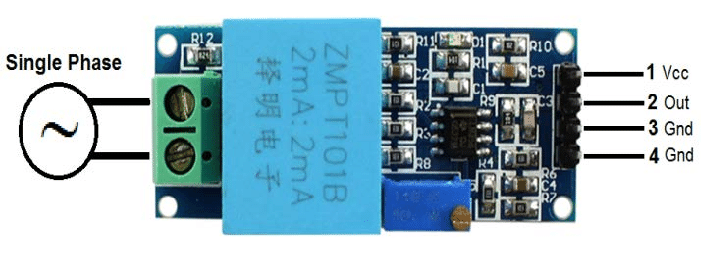

# Como usar com ESP32 – Sensor de tensão

## Descrição:

O sensor ZMPT101b é um sensor invasivo utilizado para ler a tensão.




## Especificações e características:

 - 
## Datasheet:

[Datasheet ZMPT101B](./datasheetZMPT101B.pdf)

## Aplicações:

Projetos com ESP32 ou outras plataformas microcontroladas em que seja necessário fazer a medição da corrente que alimenta determinada carga

### Pinagem:

| Pino          | Saída      | Pino no ESP32          |
| ------------- | ---------- | ---------------------- |
| ${{\color{Red}\Huge{\textsf{  - \}}}}\$      | 1          |- |
| ${{\color{Gray}\Huge{\textsf{  - \}}}}\$      | 2         |-   |
| ${{\color{Lime}\Huge{\textsf{  - \}}}}\$       | 3         | -      |
| ${{\color{Blue}\Huge{\textsf{  - \}}}}\$        | 4         | -       |


## Bibliotecas:

```bash 
  #include <>
```


